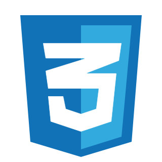
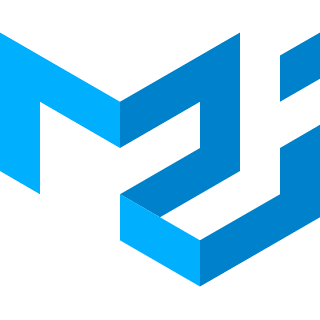
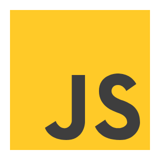

# 👋 Hi there, i'm Alireza Aslani, a React Developer.

with over 2 years of experience in Front-End Development. eager to learn and care about
the quality of codebase and simplification. I'm currently working on a Next.js project and learning App Router along with optimisation in Next.js

## Skils : 
|`Main skills`|knowleg|expreiance|`frame work / package`|knowleg|expreiance|                                                                    
| :-------- | :------- | :---------- | :--------- |:--------- |:--------- |
| | 90% |3 years|| 90 |1 year|
| | 90% |3 years|| 70% |7 months|
|| 95% |2 years|| 75% |5 months|
|| 85% |4 months|
|| 90% |1.5 years|
|| 60% | 4 months |

## [My Resume](./en-resume.pdf)
## Contact Info
- Linkedin : https://linkedin.com/in/alireza-aslane
- Phone : +98 921 69968 41
- Email : alirezaaslane.mob7@gmail.com

## Currently learning
- Next.js
- Best React.js patterns
- Performance optimization with tools like Lighthouse and Profiler

## Recent Projects 👨‍💻
- Financial Dashboard with Next.js & MUI | 👉 [Repo](https://github.com/alirezaAslani-eng/finance-manager)

## My plan for the future
- Learn Docker and Redux
- Develop a professional portfolio website with Next.js and Tailwind CSS based on a Figma design
